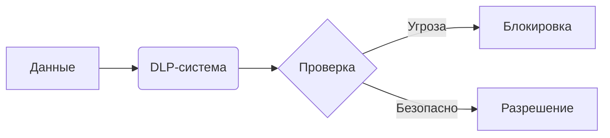

# **План презентации: «DLP-системы — защита от утечек данных»**

#### **1. Введение**  
**Цель:** Понять, зачем нужны DLP и как они работают.  
- **Что такое DLP?**  
  - *Data Loss Prevention* — технологии для предотвращения утечек конфиденциальных данных.  
- **Почему это актуально?**  
  - Примеры утечек: персональные данные клиентов, коммерческая тайна, госсекреты.  
  - Статистика: *«В 2023 году 68% компаний столкнулись с инцидентами утечек»* (по данным InfoWatch).  

---

#### **2. Как работают DLP-системы? **  
**Принципы:**  
1. **Мониторинг данных**:  
   - Анализ почты, мессенджеров, соцсетей, USB-устройств.  
   - Анализ данных с устройств
2. **Методы обнаружения**:  
   - **Контентный анализ** (ключевые слова, шаблоны типа «кредитная карта»).  
   - **Контекстный анализ** (отправка файлов в нерабочее время).  
3. **Реакция**:  
   - Блокировка передачи, уведомление администратора, шифрование.  

**Визуализация:**  

---

#### **3. Виды DLP и топ-3 продукта**  
**Типы DLP:**  
- **Сетевые** (контроль интернет-трафика).  
- **Эндпоинтные** (защита рабочих станций).  
- **Хостовые** (анализ на серверах).  

**Сравнение продуктов:**  
| Продукт             | Особенности                          | Пример использования          |  
|---------------------|--------------------------------------|-------------------------------|  
| **InfoWatch**       | Фокус на госсектор, поддержка ГОСТ   | Защита гостайны в «Ростехе»   |  
| **Symantec DLP**    | Интеграция с облаками, ИИ-анализ    | Банки (Сбербанк)              |  
| **Fortra Digital Guardian** | Гибкие политики для бизнеса      | Корпорации (Microsoft, IBM)   |  

---

#### **4. Пример работы DLP**  
**Кейс:** Утечка данных через мессенджер.  
1. Сотрудник пытается отправить файл с пометкой «Коммерческая тайна» в Telegram.  
2. DLP обнаруживает ключевые слова и блокирует передачу.  
3. Отправляет уведомление службе безопасности.  

**Интерактив:**  
- *«Как бы вы настроили DLP для защиты студенческих баз данных?»* (Обсуждение 1 минута).  

---

#### **5. Проблемы и будущее DLP**  
**Сложности:**  
- Ложные срабатывания (например, блокировка легитимных документов).  
- Обход DLP через шифрование или стеганографию.  

**Тренды:**  
- DLP + AI: предсказание утечек на основе поведения пользователей.  
- Интеграция с Zero Trust-архитектурой.  

---

#### **6. Заключение**  
- **Главное:**  
  - DLP — обязательный инструмент для бизнеса и госструктур.  
  - Эффективность зависит от правильной настройки политик.  
- **Призыв к действию:**  
  > *«Попробуйте демо-версию Symantec DLP и проанализируйте свой трафик!»*  

---

**Дополнительно:**  
- **Для наглядности:** Скриншоты интерфейсов DLP (например, панель мониторинга InfoWatch).  
- **Для вовлечения:** Мини-квиз (*«Что DLP проверяет в первую очередь: a) Слова, b) IP-адреса, c) Размер файла?»* → Ответ: **a**).  
